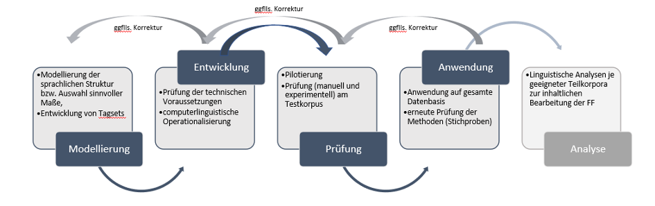
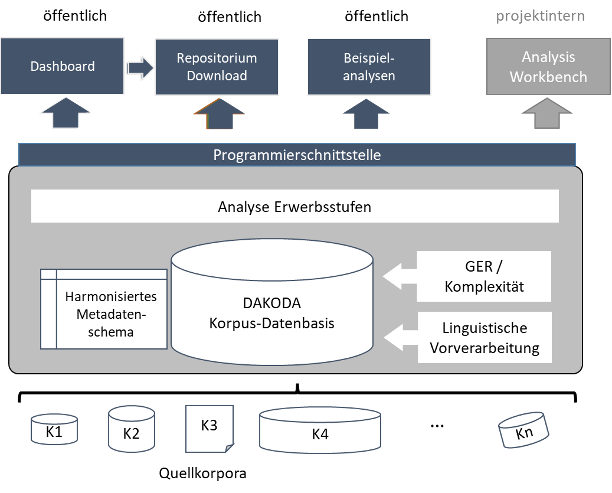

## Ziele

DAKODA verfolgt drei Kernziele:

  
<b>1.	Explorative automatisierte Analysen von syntaktischen Erwerbsstufen </b>

  

  

  Linguistischer Dreh- und Angelpunkt in DAKODA sind die sogenannten Erwerbsstufen, die v.a. basale Wortstellungsmuster im Fremd- und Zweitsprachenerwerb (L2) fokussieren. Sie wurden zunächst im ZISA-Projekt beschrieben (Clahsen et al., 1983) und dann insbesondere in der Processability Theory weiterentwickelt, wo sie eine fundamentale Rolle spielen (Lenzing et al., 2019; Pienemann, 1998; 2005). Auch in der Sprachdiagnostik finden sie in verschiedenen profilanalytischen Verfahren breite Anwendung (z.B. Grießhaber, 2012). Die Erwerbsstufen sind der wohl am intensivsten beforschte linguistische Aspekt des Deutschen als L2. Dennoch bleiben teils grundlegende Gesichtspunkte dazu eher lückenhaft beantwortet, und es ergeben sich weiterführende Fragestellungen. 

  

  Zum einen gilt dies für unterschiedliche Facetten von Variation. Denkbar ist, dass verschiedene lernendeninterne (z.B. das Erwerbsalter) und -externe (z.B. Aufgabenstellungen) Variationsfaktoren den Aneignungsverlauf der für die Erwerbsstufen relevanten sprachlichen Gegenstände beeinflussen könnten. Auch die beträchtliche inter-, aber auch intraindividuelle lernersprachliche Variation selbst ist wieder ins Zentrum der Aufmerksamkeit der L2-Erwerbsforschung gerückt und wird durch verbesserte Analysemethoden deutlicher sichtbar als zuvor: Erwerbsverläufe erweisen sich oft als nicht-linear und dynamisch. Unterschiedliche Variationsdimensionen spielten für die Analysen im DAKODA-Projekt deshalb eine wichtige Rolle. 

  

  Zum anderen ist der Fokus der Erwerbsstufen auf grundlegende Wortstellungsmuster und einige wenige morphologische Phänomene aus linguistischer Sicht eng. Mit welchen anderen sprachlichen Aspekten die Stufen zusammenhängen, ist bislang kaum erforscht. Durch die explorative automatisierte Analyse ausdifferenzierender sprachlicher Phänomene (z.B. Typen der Vorfeldbesetzung für den Erwerb von V2) und der linguistischen Komplexität sowie die vorgesehene automatische Klassifizierung der lernersprachlichen Texte in Niveaustufen des Gemeinsamen europäischen Regerenzrahmens (GER, Europarat, 2001, 2020) sollten in DAKODA etwaige derartige Zusammenhänge ins Licht gerückt werden. 

  

  Grundsätzlich ist zu konzedieren, dass automatisierte Lernersprachenanalysen von erheblichen technischen Herausforderungen geprägt und fehleranfällig sind. Ziel von DAKODA war deshalb zunächst eine erste, fundierte und gut reflektierte Einschätzung prinzipieller <a href="https://doi.org/10.18653/v1/2025.law-1.15">Möglichkeiten und Grenzen automatischer Analyseverfahren für L2-Erwerbsstufen des Deutschen</a>. Dazu wurden die in DAKODA zu entwickelnden automatisierten Annotationsverfahren iterativ in mehreren Qualitätsprüfungszyklen prozessorientiert hinsichtlich ihrer Genauigkeit und Validität eingeschätzt und revidiert. Die entwickelten Tools trugen also explorativen Charakter. 

  

    

      

        
      

    

  

  

  
<b>2. Zusammenführung vieler Lernerkorpora; Zugang über ein Dashboard und ein Repositorium </b>

  

  

  Viele Studien befassen sich empirisch mit den oben beschriebenen Erwerbsstufen und analysieren in der Regel selbst neu erhobene Daten. Allerdings beziehen sich diese Arbeiten oft auf wenige Lernende. Hinzu kommt, dass die L2-Daten – aus oft plausiblen rechtlichen und/oder ethischen oder aber ressourcenbezogenen Gründen – meist nicht publiziert werden. Öffentliche Lernerkorpora des Deutschen wiederum sind nicht immer leicht auffindbar und/oder zugänglich. Größere Lernerkorpora wie etwa FALKO oder MERLIN sind nicht hinsichtlich der Erwerbsstufen annotiert.
  

  

  Auf inhaltlich-methodischer Ebene würde eine breitere Datenbasis Befunde zum L2-Erwerb somit auf eine deutlich solidere Grundlage stellen. Auf Ebene des Datenmanagements entspricht eine Veröffentlichung von Forschungsdaten den
  <a href="https://forschungsdaten.info/themen/veroeffentlichen-und-archivieren/faire-daten/">FAIR-Prinzipien</a>: Daten sollen auffindbar, zugänglich, interoperabel und wiederverwendbar sein.
  

  

  Vor diesem Hintergrund sollten in DAKODA möglichst viele veröffentlichte und, so rechtlich und ethisch möglich, auch bislang unveröffentlichte Lernerkorpora technisch zusammengeführt werden. Im DAKODA-Forschungsprojekt haben über 40 Kolleg:innen einer Zusammenarbeit zugestimmt. Zu DAKODA wurden unter anderem Erwerbskorpora, wie <a href="https://www.unige.ch/lettres/alman/de/recherche/abgeschlossene-projekte/digs/digs-korpus">DiGS</a> (Diehl et al. 2000), <a href="https://clarin.eurac.edu/repository/xmlui/handle/20.500.12124/25">Leonide</a> (Glaznieks et al. 2022); geschriebene DaF-Korpora, z.B. <a href="http://hdl.handle.net/10932/00-0534-6404-3CE0-0001-3">DISKO</a> (Wisniewski et al. 2022), <a href="https://hu-berlin.de/falko">FALKO-Familie</a> (Hirschmann et al. 2022), <a href="https://www.merlin-platform.eu/#">MERLIN</a> (Wisniewski et al. 2013) und weitere; gesprochene DaF-Korpora, wie <a href="https://www.linguistik.hu-berlin.de/de/institut/professuren/korpuslinguistik/forschung/bematac">BeMaTaC</a> (Sauer & Lüdeling 2016) und gemischte Designs, wie <a href="https://www.linguistik.hu-berlin.de/en/institut-en/professuren-en/rueg/rueg-corpus">RUEG</a> (Wiese et al. 2021) oder <a href="https://www.uni-potsdam.de/de/daf/projekte-1/multilit-korpus">MULTILIT</a> (Schroeder & Schellhardt, 2015) konsolidiert. 

  

  

  Diese Lernerkorpusdaten wurden mit explorativen automatisierten Annotationen angereichert (siehe Ziel 1). Die Lernerkorpora wurden dann zum einen in einem Online-Speicherort (Repositorium) abgelegt. Von dort können sie in Abhängigkeit von datenschutz- und lizenzrechtlichen Bestimmungen heruntergeladen werden. Zum anderen wurde in DAKODA ein Dashboard produziert, also eine Nutzer:innenschnittstelle.  Dafür entwickelte das Team ein <a href="https://doi.org/10.5281/zenodo.18566750">Metadatenschema</a>, über das die einzelnen Korpora miteinander verankert wurden, sodass korpusübergreifend in ihnen gesucht werden kann.
  

  

  Das Dashboard beinhaltet auf den Kernschwerpunkt von DAKODA bezogene Such- und Filterfunktionen sowie einige Visualisierungsfunktionen. DAKODA ist damit keine allgemeine Korpusinfrastruktur für Lernerkorpora des Deutschen, sondern konzentriert sich auf die genannten, ausgewählten linguistischen Gegenstände und deren explorative automatisierte Analyse.
  

  

  
<b>3. Förderung der Datenkompetenzen des wissenschaftlichen DaF-/DaZ-Nachwuchses </b>

  

  

  Übergeordnetes Ziel von DAKODA war die Förderung der Datenmanagement- und Datenanalysekompetenzen des wissenschaftlichen DaF/DaZ-Nachwuchses. Dieses Desiderat erwuchs aus den immer größeren zur Verfügung stehenden, oft heterogenen (L2-)Datenmengen und vor dem Hintergrund der wachsenden Bedeutung des Forschungsdatenmanagements. DAKODA vermittelte Wissen zum Umgang mit großen Datensätzen in korpusübergreifenden Ansätzen, zu Datenformaten und -konvertierungen, automatischen Analysen und deren Herausforderungen, aber auch zu Visualisierungsmöglichkeiten nicht nur innerhalb des Projekts selbst, sondern darüber hinaus auch an die Community von Nachwuchskolleg:innen des Fachs DaF/DaZ. Deshalb wurden eine <a href="https://project.dakoda.org/events/">Reihe offener digitaler Workshops und eine Sommerschule</a> durchgeführt, um solche Fähigkeiten tiefer im Fach zu verankern. 

  

 

## Workflow

Der Projektworkflow wird in der folgenden Abbildung zusammengefasst:

  

    

      
    

  

Im Projekt wurden zunächst eine Reihe an Lernerkorpora des Deutschen als L2 zusammengeführt und technisch konsolidiert. Datenformate wurden vereinheitlicht und konvertiert. Ein harmonisiertes, korpusübergreifendes Metadatenschema wurde entwickelt. Dies geschah unter Anwendung und in Erweiterung vorliegender Standardisierungsvorschläge (Granger & Paquot, 2017[^1]; König et al., 2022[^2]). Ziel war, die Daten korpusübergreifend nach Metadaten durchsuchen und filtern zu können. Außerdem wurde ein geeignetes Mehrebenenannotationsformat gewählt.

Dann wurde eine einheitliche linguistische Vorverarbeitung (POS-Tagging, Parsing) durchgeführt und erprobt. Es schlossen sich unterschiedliche automatisierte Analysen an. Diese betrafen zum einen den Kerngegenstand von DAKODA, die Erwerbsstufen. Über programmierte Jupyter Notebooks wurde ein automatisches Klassifikationsverfahren zur Einschätzung der GER-Niveaus von Lernendentexten entwickelt, und es erfolgten automatisierte Analysen der linguistischen Komplexität.

Alle in DAKODA durchgeführten Analysen wurden durchgeführt, ohne dass die originalen Fassungen der Quellkorpora verlorengehen; DAKODA-Annotationen wurden zudem transparent als solche kenntlich gemacht.
Datenschutz- und lizenzrechtliche Vorgaben wurden im Projekt streng beachtet.

[^1]: Granger, S. & M. Paquot (2017). Towards standardization of metadata for L2 corpora. Invited talk at the CLARIN workshop on Interoperability of Second Language Resources and Tools, 6-8 December 2017, University of Gothenburg, Sweden
[^2]: König, A., Frey, J., Stemle, E., Paquot, M. (2022). Towards standardizing LCR metadata. Paper presented at the Learner Corpus Conference in Padova, Italy, 22-24 September 2022, Università di Padova.
